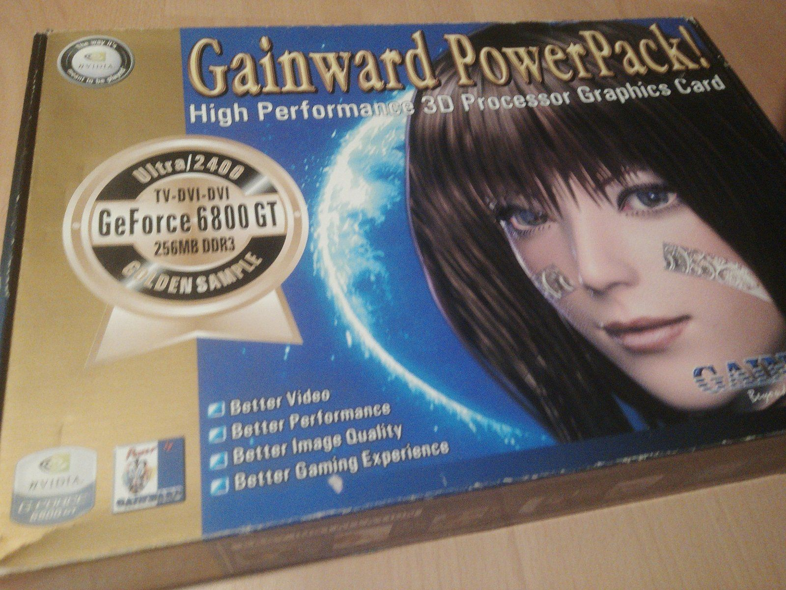

I just sold my Gainward Powerpack Ultra/2400 Geforce 6800 with 256MB on the bay. I got that thing from a friend in 2005, but didn't really know a lot about computers (I just wanted to play games) and couldn't get it to run. It was also a little too big and I had to use a metal saw to get it in, but no luck. That thing costed around 500€ back then. I don't know why my friend just gave it to me. But since I didn't really use it, it was in still in great condition. Not a lot of hours on its back.

There was quite a run on this item. A bunch of guys wrote to me that they were looking for that thing for years. Just out of curiosity I was asking, what are they planning to do with an near 20 years old graphics card. Apparently, there was a lot of biographical nostalgia involved with some of the prospective buyers. One of them said, he wanted to finally assemble the kind of PC he couldn't afford as a teenager. The person I eventually sold the card to said that, besides being a collector of vintage graphic cards, this is the exact same card he owned back in the day and that's why he really wants it again. He's also very much into old gear and it's a lot of fun to him. Also, when stuff is broken he likes to repair it.

I gotta admit, I don't really get how people are nostalgic for these kinds of things, even though I'm susceptible for Y2K nostalgia myself and I do love the box art of those old graphics cards:

