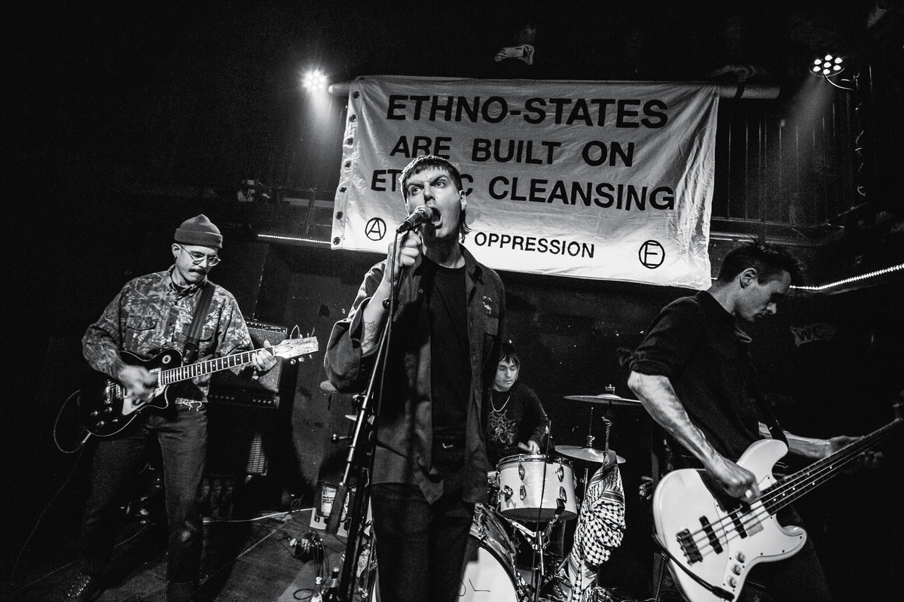

As you can see in this promo photo, the Berlin-based band Industry is a punk band very invested in the Yugoslav Wars of the 90s, when Serbian military forces under the leadership of Ratko Mladić massacred thousands of Bosniaks in the Republika Srpska with the aim of establishing a pure Serbian ethno-state. Of course, given the current news situation, one could assume that the band is referring to the Middle East war with their banner and it sure looks like they're trying to delegitimise the state of Israel as such by claiming that the whole ‘Israel project’ was a bad idea from the outset, because it is ethnonationalist and Zionist and therefore somehow colonialist and ideology-driven with no place for Muslims or anything. But if that were the way the band's thinking, it would be ludicrous how they don't recognise their own double standards. Let's assume, that there's an Islamist terror group with the project of establishing a Jew-free Palestinian state, the band Industry should have a smart slogan about that on a banner, too. But they don't. So I guess they are pretty impartial with regards to the the Israel-Palestine question and it's really about the Yugoslav Wars here and we now finally have a band that takes a stand in that conflict 30 years later.
