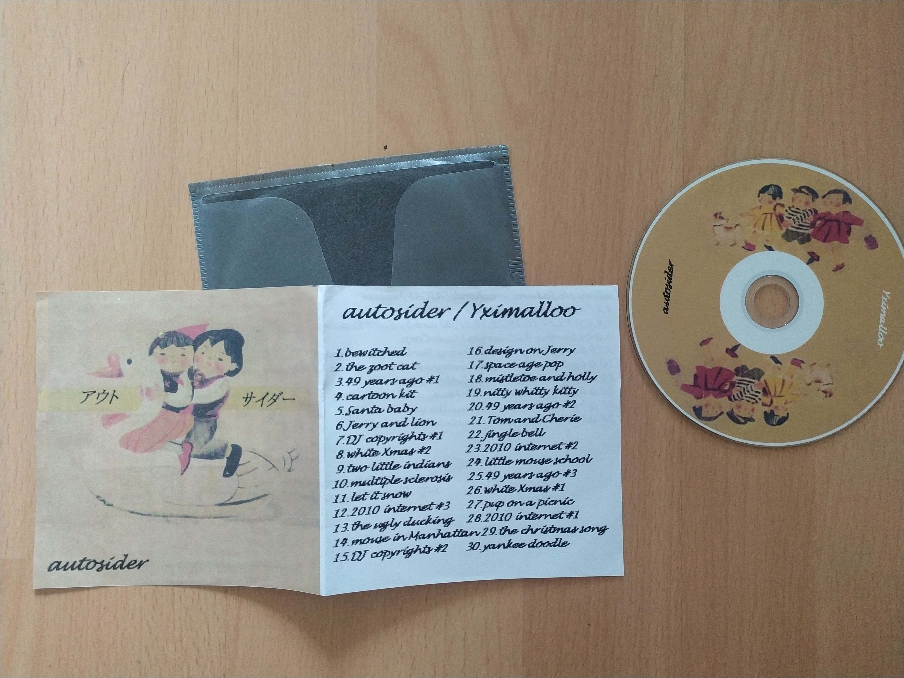
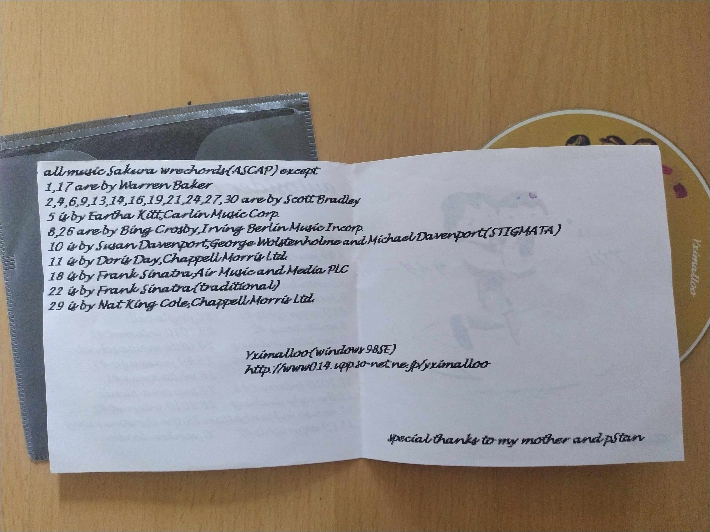

A rather recent (though already 10 years old) album of Japanese tape/CDr artist Yximalloo (aka. Nao), which I bought at Braille Satellite festival this year, where I had the pleasure to see the guy perform live, which was mostly him dancing to his beats on playback and singing into an unplugged microphone or playing guitar on an (unplugged) flower bouquet. Great fun! If this is what being an elderly man looks like, I'm no longer afraid of growing old.

He had a bunch of tapes, CDs and CDrs (and a vinyl compilation) with him, but I opted for this one, because I remembered already looking for it, but finding no copy online. I'm sharing this collection of minced 50s US movie samples and whatnot here for your delight. Consider buying his stuff though. [Nao's on Discogs](https://www.discogs.com/de/seller/Yximalloo/profile).

[Yximalloo: Autosider](https://mega.nz/file/9EojEIiD#snkDwia18sCVz2nbcMmRLs8D9xWfyXXzrh20d30xVX4) (Sakura wrechords – cdr-13, 2010)

